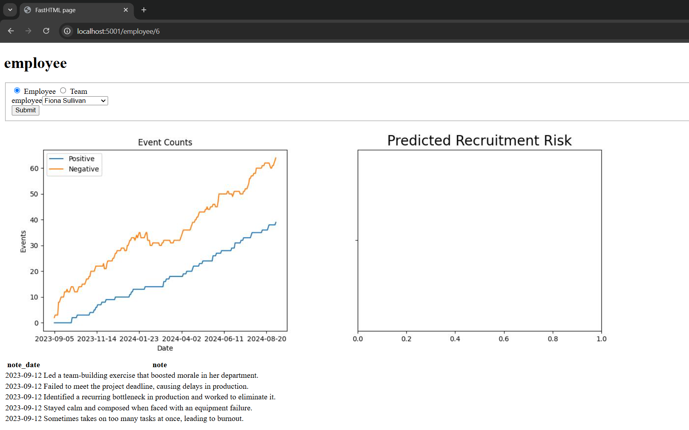
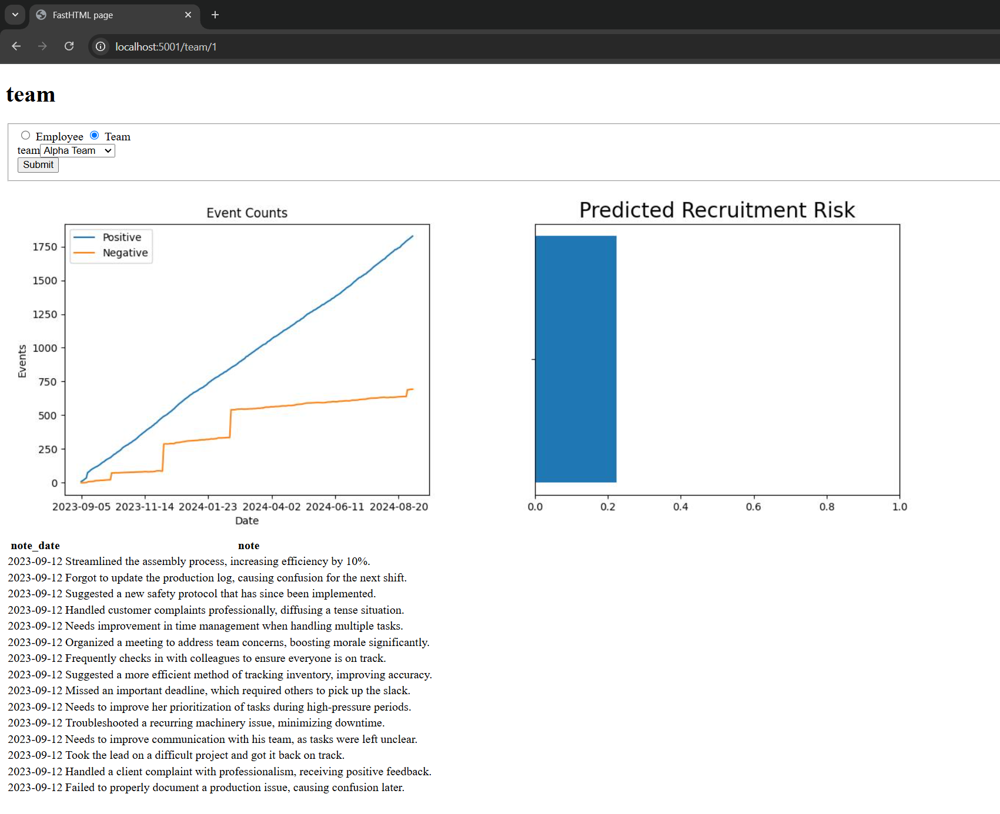

## DSND-Dashboard-Project

In this project, I will apply what I have learned through the Data Engineering course provided by Udacity and use some skills like building Python packages, object-oriented programming, and creating a simple data dashboard to visualize the data to the user.

## Project Motivation 
The primary motivation behind this project is to help the company's management retain top talent by providing a data-driven approach to monitor employee performance and predict recruitment risks. Key objectives:    
1. Address Employee Retention Concerns
2. Leverage Data for Smarter Decisions
3. Predict Recruitment Risk Using Machine Learning
4. Improve Management Efficiency
5. Standardize Performance Evaluation

## Table of contents
- [Project Motivation](#motivation)
- [Installation](#installation)
- [File Descriptions](#files)
- [How to Interact](#interaction)
- [Results](#results)
- [Licensing, Authors, Acknowledgements](#licensing)

## Installation 
The whole project is provided above as Python scripts, it should work properly in the terminal by entering the following codes in sequence:  
- First, open the terminal
- Then go to the project directory by typing: cd (the path of the whole project). For example, cd C:\Desktop\dsnd-dashboard-project
- After that you should create your virtual environment by typing: python -m venv env
- Then you should activate the environment by typing: env\Scripts\activate
- After that you should install dependencies by typing: pip install -r requirements.txt
- Now you have to make sure that you are in the root directory of the project and run this command: python report/dashboard.py
- Finally, after running the command the terminal should provide you with an address and you should write it down in your browser, the address should look something like this: http://localhost:5000

## File Descriptions 

### **python-package/**
Contains the core Python package for data handling and SQL queries.
- **employee.py**: Manages employee-specific data queries.
- **team.py**: Handles team-related data queries.
- **query_base.py**: Defines base classes for reusable SQL queries.
- **sql_execution.py**: Executes SQL queries using decorators for efficiency.
- **employee_events.db**: SQLite database storing employee and event data.

### **report/**
Code for building the interactive dashboard using FastHTML.
- **dashboard.py**: Main file that integrates all components and defines routes.
- **utils.py**: Utility functions, including model loading and file path management.

### **tests/**
Test scripts to validate database tables and functions using `pytest`.
- **test_employee_events.py**: Unit tests for database structure and query accuracy.

### **Other Files**
- **requirements.txt**: Lists all project dependencies for easy setup.
- **assets/**: Stores static files like the trained ML model (`model.pkl`) and CSS styles.

## How to Interact 
### Explore Dashboard Features
- **Switch Between Employee and Team Views:**
  - Use the radio buttons to select **Employee** or **Team**.
- **Select Profiles:**
  - Choose an employee or team from the dropdown list.
- **View Data Visualizations:**
  - **Line Chart:** Shows cumulative positive and negative event trends.
  - **Bar Chart:** Displays predicted recruitment risk.
- **Check Notes:**
  - Scroll down to view performance-related notes for the selected profile.

## Results 

### Dashboard Overview
The dashboard provides a comprehensive view of employee performance and recruitment risk. It includes the following key components:
1. Employee/Team Selection
2. Event Counts
3. Recruitment Risk Prediction
4. Notes

### Screenshots
Here are some screenshots of the dashboard in action:

## Licensing, Authors, Acknowledgements 
- This project is an open-source project. You are free to use, modify, and distribute the code and data, provided that proper credit is given to the original authors.  
- This project was created by (Jawad Kalthoom), an AI student currently pursuing a data science nanodegree. You can reach out to me on <a href="https://www.linkedin.com/in/jawad-kalthoom/"><strong>LinkedIn</strong></a> or <a href="https://github.com/JKalthoom"><strong>GitHub</strong></a> for any questions or collaborations.  
- Finally, I would like to thank Appen for the dataset and for making it accessible, and my instructors from Udacity for their guidance.
